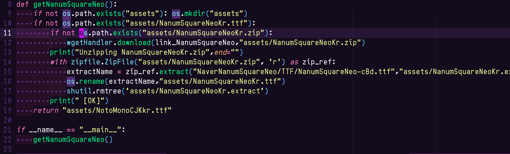

# KAWAII MONO

## Building

### Prebuilt

[Release 탭](https://github.com/qwreey75/KawaiiMono/releases/latest)에서 ttf 파일을 다운로드 받을 수 있습니다.  
Release 에는 Nerd Fonts, Liga, 한중일 글립이 모두 포함된 완전한 완성본만 취급합니다  
웹 폰트 등으로 사용하는 경우 용량 이슈로 직접 빌드를 통해 필요없는 기능을 제거해야합니다  

### Linux 에서 (Ubuntu 추천)

**Dependence** : fontforge, python3 패키지를 받습니다  
```
sudo apt install fontforge python3
```
*Ubuntu 에 기본설치되는 gnu make 또한 필요합니다.*  

이 리포지토리를 받습니다  
```
git clone --recursive --depth 1 https://github.com/qwreey75/KawaiiMono KawaiiMono
```

config.py 파일을 필요에 맞게 편집합니다. 설명은 해당 파일을 열어 확인하세요  
```
vim config.py
```

폰트를 빌드합니다. 일반적으로 out 폴더에 ttf 파일이 출력됩니다  
```
make build
```
리눅스에서 사용하는 경우, ~/.local/share/fonts 에 자동으로 ttf 파일을 복사하도록 `make install` 을 사용할 수도 있습니다  

### Docker

향후 추가 예정  

## License

[license 파일](https://github.com/qwreey75/KawaiiMono/blob/master/license)을 참고해주세요.
submodule 과 assets 폴더에 자동 생성되는 파일들을 제외한 이 리포지토리의 모든 파일은 (KawaiiMono**.sfd 포함한) 다음의 라이선스에 영향받습니다  

| Permissions | Limitations | Conditions |
|-------------|-------------|------------|
| ✅ Commercial use | ❎ Warranty | ❓ License and copyright notice |
| ✅ Distribution | ❎ Being Rude | |
| ✅ Modification | ❎ Russian, And supporting war | |
| ✅ Private use | ❎ Copy without any modification | |

다음과 연관된 컨텐츠는 각각 개별적인 라이선스를 가집니다  
**이 git 저장소에는 해당 컨텐츠를 직접적으로 포함하지는 않으나, 패치시 해당 컨텐츠를 다운로드 받아 패치 타겟 파일에 해당 컨텐츠를 붙여넣으므로 빌드 출력 결과 파일에는 해당 라이선스가 포함됩니다.**  
컨텐츠의 포함 여부는 `config.py` 파일의 상황에 따라서 달라질 수 있습니다.

> 사용된 Noto Mono 는 Google 이 소유하며, OFL 라이선스를 따릅니다.  
> 사용된 NanumSquareNeo 는 Naver 가 소유하며, OFL 라이선스를 따릅니다.  
> 사용된 Nerd Fonts 글리프는 [여기](https://github.com/ryanoasis/nerd-fonts/blob/master/license-audit.md) 에서 라이선스 정보를 확인해 주세요.  

OFL 라이선스의 폰트가 패치에 사용된 경우, 그 폰트가 웹폰트와 같이 배포의 형태로 사용되려면 필수는 아니지만 패치 소스의 라이선스 표기가 권장됩니다.  
([SIL 공식 사이트 OFL-FAQ](https://scripts.sil.org/OFL-FAQ_web)의 문항 1.1.2, 사용에 대한 표기가 필수사항은 아님)  
*※ 법적 분쟁 발생시 본 의견은 법률적 해석이나 논리로 활용될 수 없습니다.*  

자세한 사항은 각자의 입장이 담긴 공식 사이트를 확인하세요.  
[네이버 고객센터 : 네이버 나눔스퀘어& 네이버 폰트 라이선스](https://help.naver.com/service/30016/contents/18088?osType=PC&lang=ko)  
[구글 Fonts : NotoSansCJKKr](https://fonts.google.com/noto/specimen/Noto+Sans+KR/about)  
[SIL Open Font License (OFL)](https://scripts.sil.org/cms/scripts/page.php?site_id=nrsi&id=OFL)  
[NerdFonts : 글리프](https://github.com/ryanoasis/nerd-fonts/blob/master/license-audit.md)  

일반적인 경우, 다음의 표기가 권장됩니다.  

> 이 페이지에는 네이버에서 제공한 NanumSquareNeo 폰트, 구글에서 제공한 NotoSansCJKKrMono 폰트, qwreey75@gmail.com 에서 제공한 Kawaii Mono 폰트, NerdFonts 에서 제공된 글리프가 포함되어 있습니다.

## Issue

가독성이나 미적인 토론(?) 은 [이슈](https://github.com/qwreey75/KawaiiMono/issues/new)를 이용하거나 qwreey75@gmail.com 으로 메일링 할 수 있습니다.  

## TODO

1. 합자자를 추가합니다.
2. 기울임 폰트를 추가합니다.
3. 굵은 폰트를 추가합니다.
4. Nerd Fonts 를 지원합니다.
5. B 와 같은 둥근 글리프의 가독성을 향상시킵니다.

### 안 이루워질 TODO

~~일해라 쿼리~~

ps1 스크립트로 윈도우 설치 자동화와, 윈도우 호환성을 만듭니다(가능한가 의문)  
